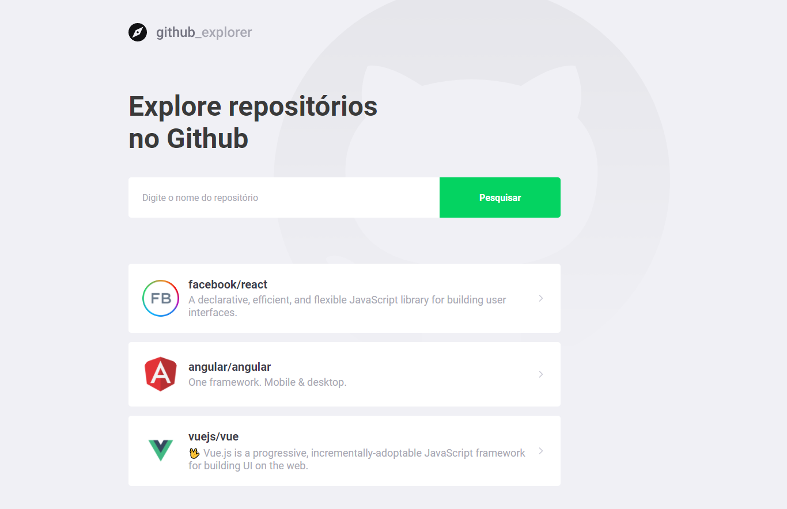

# GitHub Explorer

A aplicação tem o objetivo de listar os seus respositórios favoritos do github e listar suas informações

<h3>✅ Status do projeto</h3>
<h4>Projeto em construção... 🧱</h4>

<h3>✅ Features</h3>
-[X] - Buscar por repositórios
-[X] - Listar repositórios
-[X] - Mostrar informações dos repositórios
-[ ] - Responsividade da aplicação

<h3>✅ Demostração da aplicação</h3>
<h1 align="center">
  
</h1>

<h3>✅ Pré-requisitos e como rodar a aplicação</h3>

Antes de começar você precisar ter instalado em sua maquina o NodeJS (https://nodejs.org/en/) e o Git (https://git-scm.com/).
Para facilitar o desenvolvimento é interessante possuir um editor de código como o VSCode (https://code.visualstudio.com/).

### Rodando a aplicação

Abre o seu terminal e rode o comando abaixo

$ git clone https://github.com/lagalvao/github-explorer.git

Em seguida entre na pasta do projeto

$ cd github-explorer

Depois rode o comando abaixo para instalar as dependências

$ npm install

Por fim execute a aplicação no modo de desenvolvimento

$ npm start

<h3>🛠 Tecnologias utilizadas</h3>
- [React] (https://pt-br.reactjs.org/)
- [Typescript] (https://www.typescriptlang.org/)
- [Styled-components] (https://styled-components.com/)
